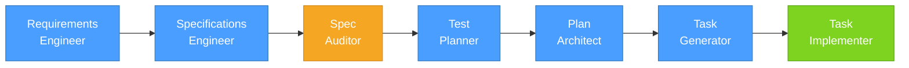
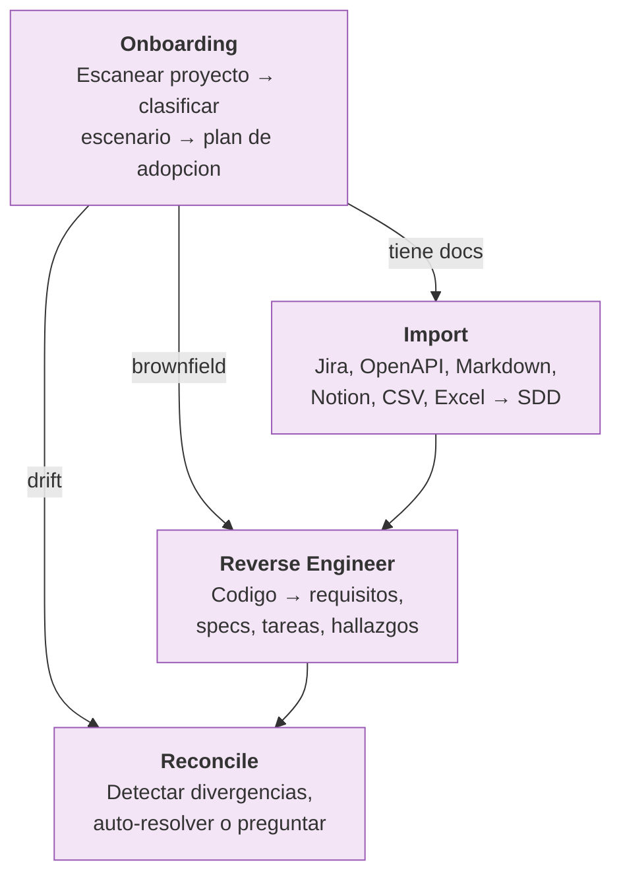
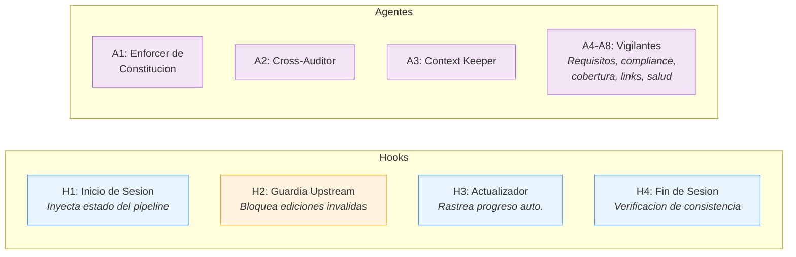

# SDD Plugin para Claude Code

> **[Read in English](README.md)**

Un plugin de [Claude Code](https://docs.anthropic.com/en/docs/claude-code) que transforma requisitos en codigo de produccion a traves de un pipeline estructurado y auditable. Basado en SWEBOK v4. Funciona con proyectos nuevos y existentes.

**19 skills** &middot; **8 agentes** &middot; **4 hooks** &middot; **Trazabilidad completa**

## Como Funciona

El plugin te guia a traves de un pipeline lineal — cada paso produce artefactos que alimentan el siguiente:



Cada artefacto es trazable de extremo a extremo:


## Instalacion

```bash
# 1. Habilitar marketplace (una vez)
claude plugin marketplace

# 2. Instalar (dentro de Claude Code)
/plugin install github:noelserdna/claude-plugin-sdd

# 3. Verificar
/sdd:pipeline-status
```

## Inicio Rapido

### Proyecto nuevo (greenfield)

```
/sdd:setup                       # Inicializar pipeline
/sdd:requirements-engineer       # Elicitar requisitos
/sdd:specifications-engineer     # Generar especificaciones
/sdd:spec-auditor                # Auditar y corregir specs
/sdd:test-planner                # Planificar testing
/sdd:plan-architect              # Disenar arquitectura
/sdd:task-generator              # Crear tareas atomicas
/sdd:task-implementer            # Escribir codigo + tests
```

### Proyecto existente (brownfield)

```
/sdd:onboarding                  # Diagnosticar proyecto → plan de adopcion
/sdd:import docs/api.yaml        # Importar docs existentes (OpenAPI, Jira, etc.)
/sdd:reverse-engineer            # Extraer specs del codigo
/sdd:reconcile                   # Alinear specs con codigo
```

## Que Hace Cada Skill

### Pipeline — de la idea al codigo

```mermaid
graph TD
    subgraph Pipeline
        RE["<b>Requirements Engineer</b><br/>Elicitar y escribir requisitos<br/><i>SWEBOK Ch01 · Sintaxis EARS</i>"]
        SE["<b>Specifications Engineer</b><br/>Dominio, casos de uso, contratos,<br/>workflows, NFRs, ADRs"]
        SA["<b>Spec Auditor</b><br/>Encontrar y corregir defectos<br/><i>Modo Audit + Modo Fix</i>"]
        TP["<b>Test Planner</b><br/>Plan de testing, matrices,<br/>escenarios de rendimiento · <i>SWEBOK Ch04</i>"]
        PA["<b>Plan Architect</b><br/>Archivos FASE, arquitectura,<br/>plan de implementacion · <i>Modelo C4</i>"]
        TG["<b>Task Generator</b><br/>Tareas atomicas y reversibles<br/><i>1 tarea = 1 commit</i>"]
        TI["<b>Task Implementer</b><br/>TDD, codigo, tests,<br/>commits atomicos con SHA"]
    end

    RE --> SE --> SA --> TP --> PA --> TG --> TI

    style RE fill:#e8f4fd,stroke:#4a9eff
    style SE fill:#e8f4fd,stroke:#4a9eff
    style SA fill:#fff3e0,stroke:#f5a623
    style TP fill:#e8f4fd,stroke:#4a9eff
    style PA fill:#e8f4fd,stroke:#4a9eff
    style TG fill:#e8f4fd,stroke:#4a9eff
    style TI fill:#e8f8e8,stroke:#7ed321
```



### Onboarding — adopta SDD en cualquier proyecto



| Skill | Comando | Que hace |
|-------|---------|----------|
| Onboarding | `/sdd:onboarding` | Diagnostica el estado del proyecto (8 escenarios), genera plan de adopcion |
| Reverse Engineer | `/sdd:reverse-engineer` | Analiza codigo para generar todos los artefactos SDD + informe de hallazgos |
| Reconcile | `/sdd:reconcile` | Detecta drift specs-codigo, clasifica divergencias, reconcilia |
| Import | `/sdd:import` | Convierte docs externos a formato SDD (6 formatos soportados) |

### Laterales — usar en cualquier momento

| Skill | Comando | Que hace |
|-------|---------|----------|
| Security Auditor | `/sdd:security-auditor` | Auditoria de seguridad OWASP/CWE |
| Req Change | `/sdd:req-change` | Gestionar cambios con cascade del pipeline (ISO 14764) |

### Utilidades

| Skill | Comando | Que hace |
|-------|---------|----------|
| Pipeline Status | `/sdd:pipeline-status` | Estado actual, deteccion de staleness, siguiente accion |
| Traceability Check | `/sdd:traceability-check` | Verificar cadena completa, encontrar huerfanos |
| Dashboard | `/sdd:dashboard` | Dashboard HTML interactivo de trazabilidad |
| Notion Sync | `/sdd:sync-notion` | Sincronizacion bidireccional con Notion |
| Session Summary | `/sdd:session-summary` | Resumir decisiones y progreso |
| Setup | `/sdd:setup` | Inicializar `pipeline-state.json` |

## Automatizacion

El plugin ejecuta guardrails automaticamente — no requiere configuracion manual.



**Hooks** se ejecutan en cada sesion — inyectan contexto, protegen artefactos, rastrean estado.
**Agentes** son delegados por Claude o invocados por ti — auditan, validan, monitorean.

## Estructura del Proyecto

Despues de ejecutar el pipeline, tu proyecto contendra:

```
tu-proyecto/
├── pipeline-state.json          # Seguimiento del progreso
├── requirements/
│   └── REQUIREMENTS.md          # Requisitos en sintaxis EARS
├── spec/
│   ├── domain.md                # Modelo de dominio
│   ├── use-cases.md             # Casos de uso
│   ├── workflows.md             # Workflows y maquinas de estado
│   ├── contracts.md             # Contratos API
│   ├── nfr.md                   # Requisitos no funcionales
│   └── adr/                     # Registros de decisiones
├── audits/
│   └── AUDIT-BASELINE.md        # Resultados de auditoria
├── test/
│   ├── TEST-PLAN.md             # Estrategia de testing
│   └── TEST-MATRIX-*.md         # Matrices de testing
├── plan/
│   ├── ARCHITECTURE.md          # Arquitectura C4
│   ├── PLAN.md                  # Plan de implementacion
│   └── fases/FASE-*.md          # Desglose por fases
├── task/
│   └── TASK-FASE-*.md           # Tareas atomicas (1 tarea = 1 commit)
├── src/                         # Codigo fuente generado
├── tests/                       # Tests generados
└── dashboard/
    └── index.html               # Dashboard de trazabilidad
```

## Convenciones Clave

| Convencion | Descripcion |
|-----------|-------------|
| **Sintaxis EARS** | Los requisitos usan `WHEN <trigger> THE <system> SHALL <behavior>` |
| **1 tarea = 1 commit** | Cada tarea produce exactamente un commit con trailers `Refs:` y `Task:` |
| **Clarificacion primero** | Los skills nunca asumen — preguntan con opciones estructuradas |
| **Auditoria por baseline** | La primera auditoria crea baseline; las siguientes solo reportan hallazgos nuevos |

## Estandares

Construido sobre estandares establecidos de ingenieria de software:

SWEBOK v4 &middot; OWASP ASVS v4 &middot; CWE &middot; IEEE 830 &middot; ISO 14764 &middot; Modelo C4 &middot; Gherkin/BDD

## Licencia

MIT
