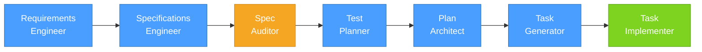
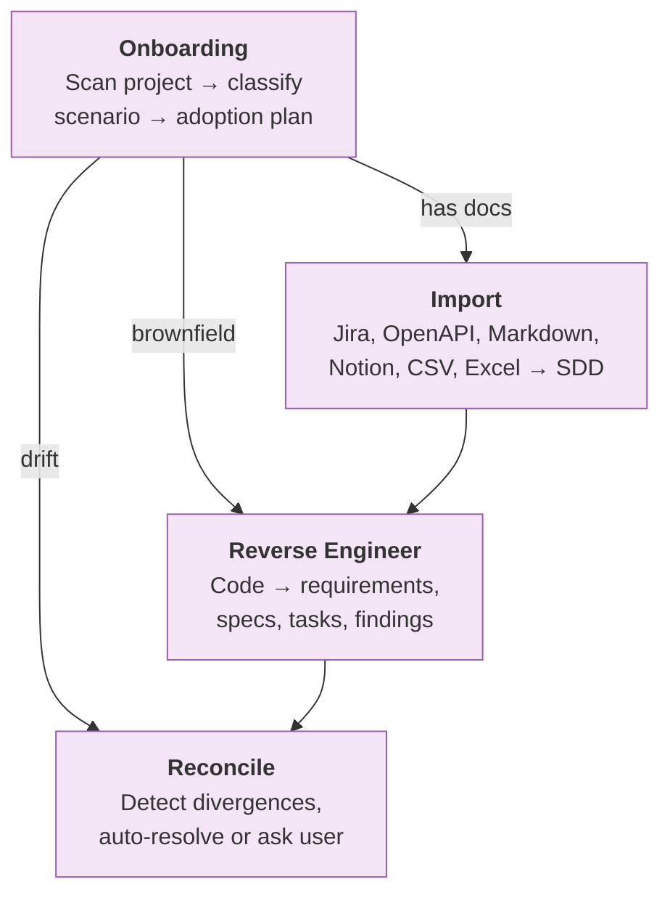
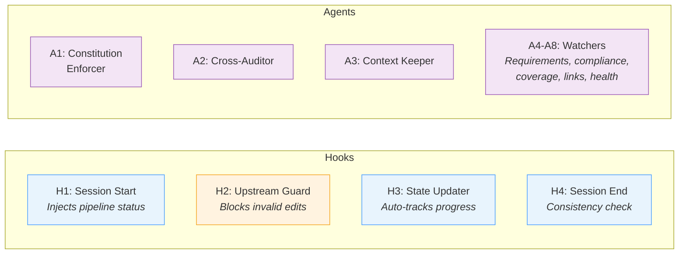

# SDD Plugin for Claude Code

> **[Leer en español](README.es.md)**

A [Claude Code](https://docs.anthropic.com/en/docs/claude-code) plugin that turns requirements into production code through a structured, auditable pipeline. Based on SWEBOK v4. Works with new and existing projects.

**19 skills** &middot; **8 agents** &middot; **4 hooks** &middot; **Full traceability**

## How It Works

The plugin guides you through a linear pipeline — each step produces artifacts that feed the next:



Every artifact is traceable end-to-end:


## Installation

```bash
# 1. Enable marketplace (once)
claude plugin marketplace

# 2. Install (inside Claude Code)
/plugin install github:noelserdna/claude-plugin-sdd

# 3. Verify
/sdd:pipeline-status
```

## Quick Start

### New project (greenfield)

```
/sdd:setup                       # Initialize pipeline
/sdd:requirements-engineer       # Gather requirements
/sdd:specifications-engineer     # Generate formal specs
/sdd:spec-auditor                # Audit and fix specs
/sdd:test-planner                # Plan test strategy
/sdd:plan-architect              # Design architecture
/sdd:task-generator              # Create atomic tasks
/sdd:task-implementer            # Write code + tests
```

### Existing project (brownfield)

```
/sdd:onboarding                  # Diagnose project → get adoption plan
/sdd:import docs/api.yaml        # Import existing docs (OpenAPI, Jira, etc.)
/sdd:reverse-engineer            # Extract specs from code
/sdd:reconcile                   # Align specs with code
```

## What Each Skill Does

### Pipeline — from idea to code

```mermaid
graph TD
    subgraph Pipeline
        RE["<b>Requirements Engineer</b><br/>Elicit &amp; write requirements<br/><i>SWEBOK Ch01 · EARS syntax</i>"]
        SE["<b>Specifications Engineer</b><br/>Domain, use cases, contracts,<br/>workflows, NFRs, ADRs"]
        SA["<b>Spec Auditor</b><br/>Find &amp; fix spec defects<br/><i>Audit mode + Fix mode</i>"]
        TP["<b>Test Planner</b><br/>Test plan, matrices,<br/>perf scenarios · <i>SWEBOK Ch04</i>"]
        PA["<b>Plan Architect</b><br/>FASE files, architecture,<br/>implementation plan · <i>C4 Model</i>"]
        TG["<b>Task Generator</b><br/>Atomic, reversible tasks<br/><i>1 task = 1 commit</i>"]
        TI["<b>Task Implementer</b><br/>TDD, code, tests,<br/>atomic commits with SHA"]
    end

    RE --> SE --> SA --> TP --> PA --> TG --> TI

    style RE fill:#e8f4fd,stroke:#4a9eff
    style SE fill:#e8f4fd,stroke:#4a9eff
    style SA fill:#fff3e0,stroke:#f5a623
    style TP fill:#e8f4fd,stroke:#4a9eff
    style PA fill:#e8f4fd,stroke:#4a9eff
    style TG fill:#e8f4fd,stroke:#4a9eff
    style TI fill:#e8f8e8,stroke:#7ed321
```



### Onboarding — adopt SDD in any project



| Skill | Command | What it does |
|-------|---------|-------------|
| Onboarding | `/sdd:onboarding` | Diagnoses project state (8 scenarios), generates step-by-step adoption plan |
| Reverse Engineer | `/sdd:reverse-engineer` | Analyzes code to generate all SDD artifacts + findings report |
| Reconcile | `/sdd:reconcile` | Detects spec-code drift, classifies divergences, reconciles |
| Import | `/sdd:import` | Converts external docs to SDD format (6 formats supported) |

### Lateral — use anytime

| Skill | Command | What it does |
|-------|---------|-------------|
| Security Auditor | `/sdd:security-auditor` | OWASP/CWE security posture audit |
| Req Change | `/sdd:req-change` | Manage changes with pipeline cascade (ISO 14764) |

### Utilities

| Skill | Command | What it does |
|-------|---------|-------------|
| Pipeline Status | `/sdd:pipeline-status` | Current state, staleness detection, next action |
| Traceability Check | `/sdd:traceability-check` | Verify full artifact chain, find orphans |
| Dashboard | `/sdd:dashboard` | Interactive HTML traceability dashboard |
| Notion Sync | `/sdd:sync-notion` | Bidirectional sync with Notion databases |
| Session Summary | `/sdd:session-summary` | Summarize decisions and progress |
| Setup | `/sdd:setup` | Initialize `pipeline-state.json` |

## Automation

The plugin runs guardrails automatically — no manual setup needed.



**Hooks** run on every session — inject context, guard artifacts, track state.
**Agents** are delegated by Claude or invoked by you — audit, validate, monitor.

## Project Structure

After running the pipeline, your project will contain:

```
your-project/
├── pipeline-state.json          # Pipeline progress tracking
├── requirements/
│   └── REQUIREMENTS.md          # EARS-syntax requirements
├── spec/
│   ├── domain.md                # Domain model
│   ├── use-cases.md             # Use cases
│   ├── workflows.md             # Workflows & state machines
│   ├── contracts.md             # API contracts
│   ├── nfr.md                   # Non-functional requirements
│   └── adr/                     # Architecture decision records
├── audits/
│   └── AUDIT-BASELINE.md        # Spec audit results
├── test/
│   ├── TEST-PLAN.md             # Test strategy
│   └── TEST-MATRIX-*.md         # Test matrices
├── plan/
│   ├── ARCHITECTURE.md          # C4 architecture
│   ├── PLAN.md                  # Implementation plan
│   └── fases/FASE-*.md          # Phase breakdown
├── task/
│   └── TASK-FASE-*.md           # Atomic tasks (1 task = 1 commit)
├── src/                         # Generated source code
├── tests/                       # Generated tests
└── dashboard/
    └── index.html               # Traceability dashboard
```

## Key Conventions

| Convention | Description |
|-----------|-------------|
| **EARS syntax** | Requirements use `WHEN <trigger> THE <system> SHALL <behavior>` |
| **1 task = 1 commit** | Each task produces exactly one commit with `Refs:` and `Task:` trailers |
| **Clarification-first** | Skills never assume — they ask with structured options |
| **Baseline auditing** | First audit creates baseline; subsequent ones report only new findings |

## Standards

Built on established software engineering standards:

SWEBOK v4 &middot; OWASP ASVS v4 &middot; CWE &middot; IEEE 830 &middot; ISO 14764 &middot; C4 Model &middot; Gherkin/BDD

## License

MIT
